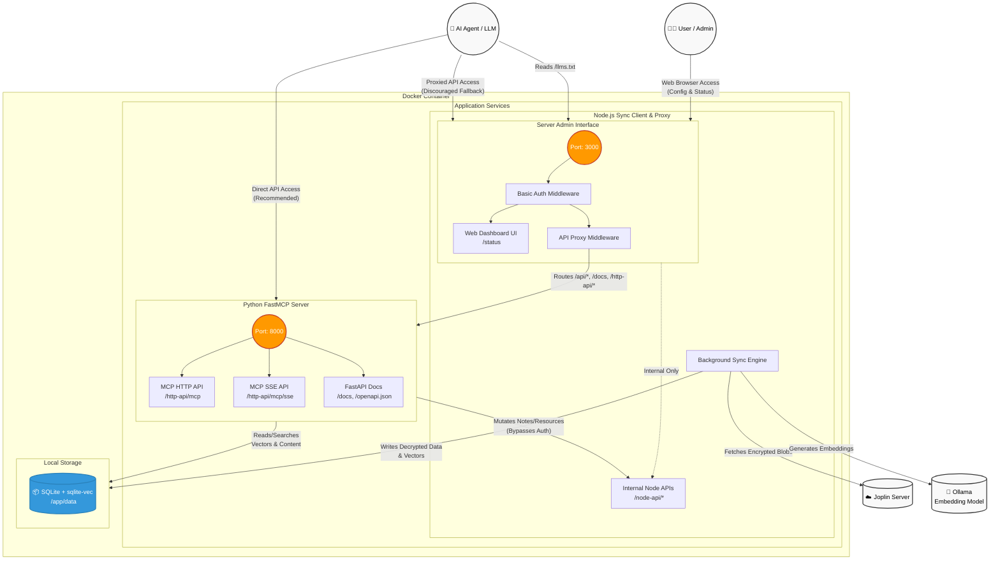

# Architecture Overview

Joplin Server Vector Memory MCP is an AI-native semantic search engine designed to interface between an End-to-End Encrypted (E2EE) Joplin Server ecosystem and an AI client via the Model Context Protocol (MCP).

## Core Components

The system is split into several primary components:

### 1. Sync Client (Node.js)
The Sync Client resides in the `client/` directory and acts as a headless daemon.
- **Responsibilities:**
  - Authenticates with the Joplin Server.
  - Synchronizes and decrypts E2EE notes using `@joplin/lib`.
  - Triggers embedding generation for the notes by calling the Python backend via `/http-api/internal/embed`.
  - Serves a dashboard GUI for setup and token generation (running on port 3000 by default).
  - Proxies traffic to the backend MCP server.
  - Manages synchronization cycles, decoupled into separate `syncState` and `embeddingState` variables to accurately track progress. These phases run sequentially within `runSyncCycle()` using an `isProcessing` lock to prevent database corruption.

### 2. MCP Server (Python)
The MCP Server is implemented using `FastMCP` and `FastAPI` in the `server/` directory.
- **Responsibilities:**
  - Exposes the MCP protocol to various AI clients over multiple transport layers:
    - Stateless HTTP (e.g., for Gemini CLI)
    - Streamable HTTP (e.g., for Cline, Claude)
    - Server-Sent Events (SSE) (e.g., for Cursor)
  - Provides a standard REST HTTP API under `/http-api/`.
  - Handles internal embedding requests (`/http-api/internal/embed`) from the Sync Client, deciding whether to use Ollama or fallback to a local CPU model.
  - Performs semantic searches and Note operations (`get`, `remember`, `delete`).

### 3. Database Layer (SQLite)
A local embedded database using `sqlite3` enhanced with extensions:
- **`sqlite-vec`**: Provides extremely fast local vector distance calculations for embeddings.
- **`FTS5` (Full-Text Search)**: Maintains a traditional keyword-based search index.
- Data is stored across multiple tables (e.g., `note_metadata` for raw content, `vec_notes` for vectors, and `notes_fts` for text search) kept in sync via triggers.

### 4. Embeddings (Python Backend / Ollama)
Embedding generation is managed entirely by the Python backend.
- **Models:** 
  - Primarily attempts to use a local Ollama container (e.g., `nomic-embed-text` to map text into 768-dimensional vectors).
  - If Ollama is unavailable, gracefully falls back to an embedded local CPU model (`all-MiniLM-L6-v2` via `sentence-transformers`, generating 384-dimensional vectors).
- Used both during the sync process (embedding notes via the internal API) and during search queries.

## Data Flow

### Syncing
1. The Sync Client polls the Joplin Server.
2. The synchronization cycle (`runSyncCycle()`) begins, protected by an `isProcessing` lock.
3. Encrypted note items are downloaded and decrypted locally. The progress is tracked in `syncState`.
4. Node.js implements a "pipelined" sync loop. It gathers exactly 32 decrypted notes at a time and sends them as a single batched JSON array (`texts: [...]`) to the Python `/http-api/internal/embed` endpoint in exactly 1 HTTP request. This completely eliminates the Node.js event-loop network bottleneck.
5. The backend generates vector embeddings using either Ollama or the local CPU fallback. The progress of this phase is tracked in `embeddingState`.
6. When the 32 embeddings return, Node.js uses a background queue to bulk-insert all 32 vectors into SQLite in a single atomic `BEGIN IMMEDIATE TRANSACTION` ... `COMMIT` block. It does this in the background while instantly fetching the next 32 notes from the GPU, preventing SQLite deadlocks and keeping the GPU fed.

### Searching (Reciprocal Rank Fusion)
1. An AI Agent sends a search query via MCP or the HTTP API.
2. The MCP Server generates an embedding for the query using its active embedding model (Ollama or local CPU fallback).
3. The server runs two searches in parallel:
   - A `sqlite-vec` k-nearest neighbors vector search.
   - An `FTS5` keyword-based BM25 search.
4. The system merges the results using **Reciprocal Rank Fusion (RRF)** to ensure highly relevant semantic and keyword matches are prioritized.
5. The top notes are returned as a result to the AI Agent.

## Security & Authentication Flow
To ensure data security and prevent the unauthorized exposure of credentials, the system employs a strict locking mechanism:
1. **Initial Boot (Setup Mode):** On first run (or if no credentials are provided via `.env`), the system boots into "Setup" mode. The background sync daemon is paused. The user accesses the web dashboard (`http://localhost:3000`) using the default credentials: **Username:** `setup`, **Password:** `1-mcp-server`.
2. **Configuration & Account Marriage:** In the dashboard, the user inputs their *real* Joplin Server credentials. The Node.js backend verifies these credentials against the remote server.
3. **Credential Interception & System Lock:** The Node.js backend intercepts the credentials, stores the passwords in volatile RAM (never writing them to disk), and permanently "locks" the local `config.json` to that specific real `joplinUsername`. It then invalidates the `setup` session and prompts the user to log in again using their real credentials via Basic Auth.
4. **Subsequent Access:** Any future API or dashboard access must match the locked username. The system will reject attempts to change the locked username via the API to prevent account takeovers.
5. **Relinquishing the Lock:** The only way to unlock the system for a different user is for the originally authenticated user to access the "Danger Zone" in the dashboard and trigger a "Factory Reset". This explicitly authenticated action wipes the entire local SQLite database, removes the synced Joplin profile, deletes the config file, and reboots the container into a clean slate.
enticated user to access the "Danger Zone" in the dashboard and trigger a "Factory Reset". This explicitly authenticated action wipes the entire local SQLite database, removes the synced Joplin profile, deletes the config file, and reboots the container into a clean slate.
